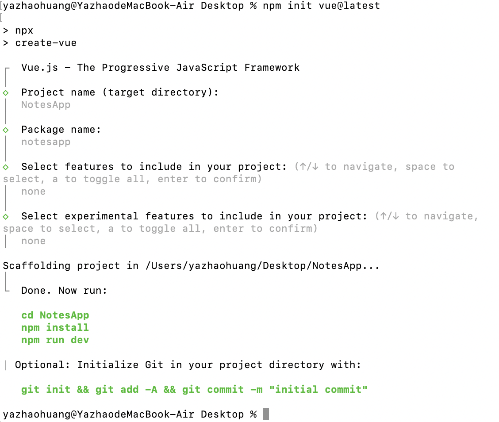
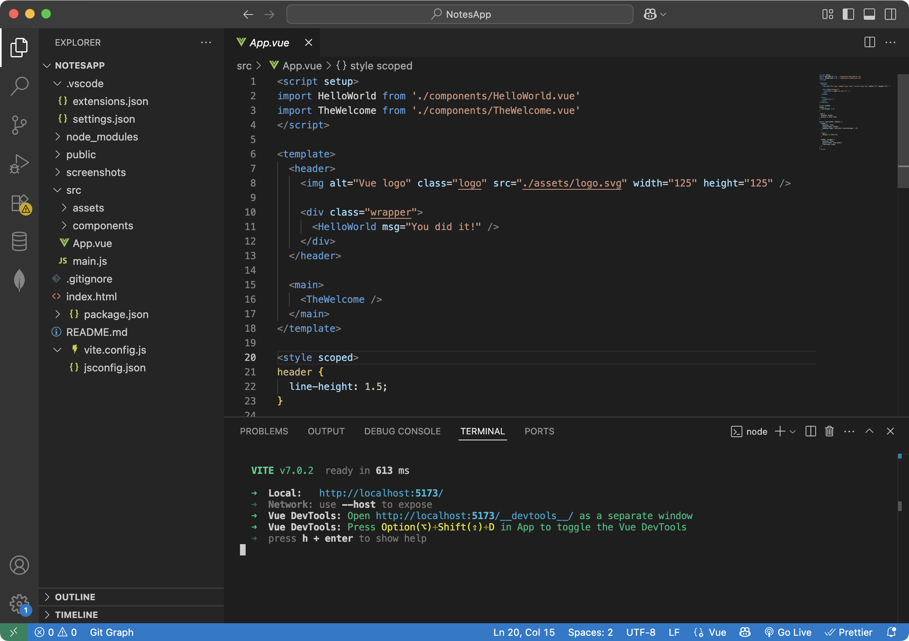
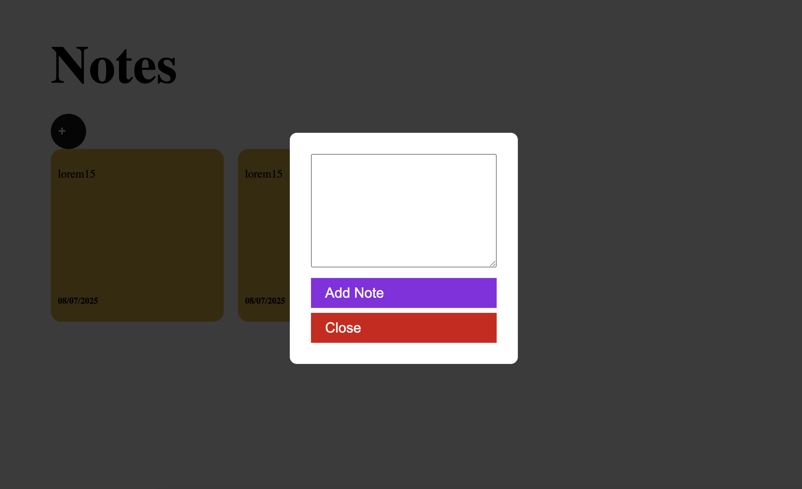
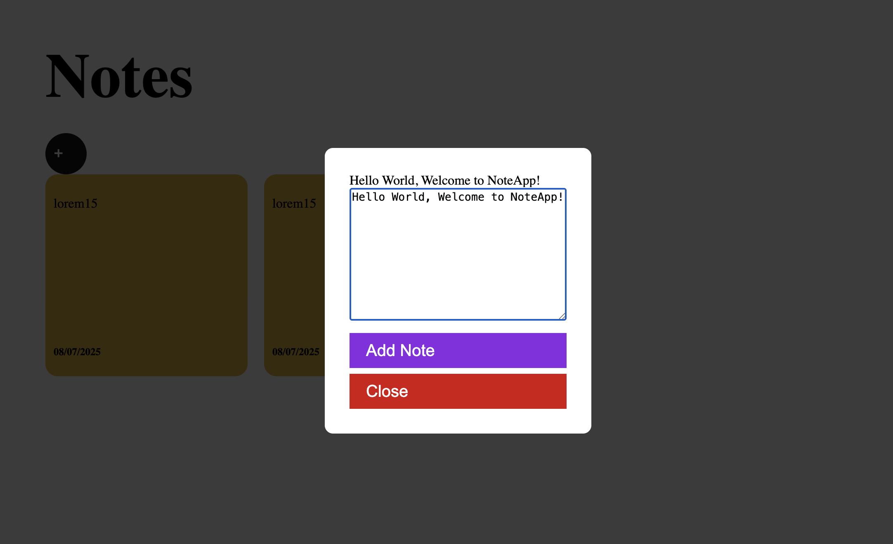
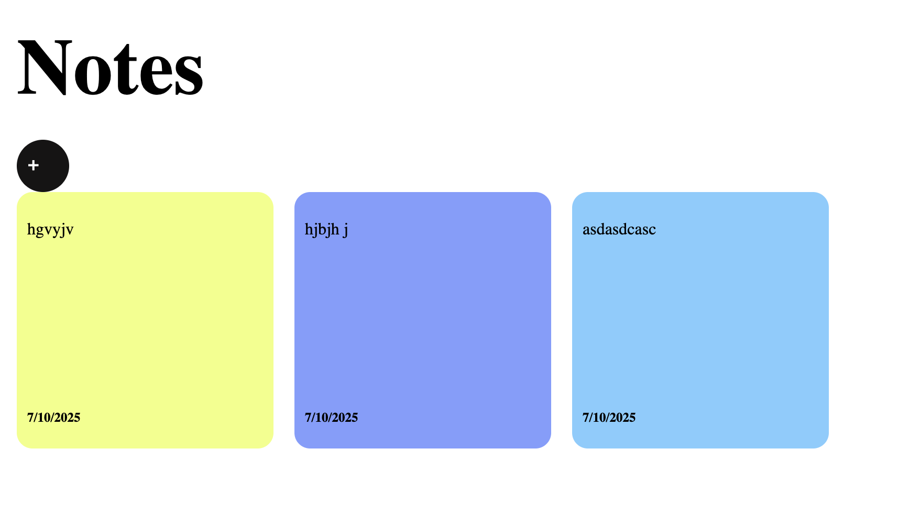
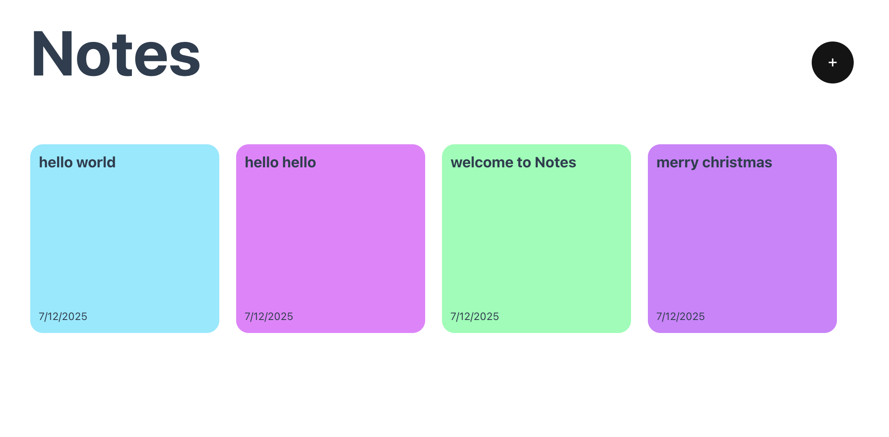

# FIT5032 Internet Applications Development – Eligibility Project

This project was completed as part of an eligibility demonstration for the Monash University unit **FIT5032: Internet Applications Development**.  

It follows **Project 2** from the tutorial: [The Ultimate Vue 3 Tutorial (100% Composition API)](https://www.youtube.com/watch?v=I_xLMmNeLDY)

## Project Description

This project is a basic Vue 3 web application built using the **Composition API**, focusing on modular component-based architecture, reactive state management, user interaction and form validation.

The tutorial guided the setup process, component construction, dynamic rendering with `v-for`, `ref`-based state handling, and styling using scoped CSS.

## How to Run

1. Clone this repository:
   ```bash
   git clone git@github.com:angiebb016/vue-project2-demo.git
   cd vue-project
   npm install
   npm run dev

## Step 1: Create Vue Project using Vite

The project was scaffolded using Vite with Vue 3 and the Composition API. I named the project `NotesApp` and it is with the default settings without adding any optional or experimental features.

After creating the project, I installed dependencies and launched the development server. The app successfully started at `http://localhost:5173/`, confirming the setup was correct.

Below are screenshots of:
- The command-line creation process using `npm init vue@latest`
- The resulting folder structure in VS Code and the Vite server running

### Vue CLI Initialization Command



### Project Structure and Dev Server



## Step 2: Set Up the Basic UI

In this step:
I added the layout for the app in App.vue, including a modal and a couple of static note cards.
Styled the page directly inside App.vue with scoped styles to make sure layout and appearance are consistent.
Deleted old contents of main.css, since we no longer need the previous global styles.

### Notesapp Layout Preview



## Step 3: Add Note Input Modal (v-model Binding)

In this step, I added a modal input form that allows users to write and update a note. The modal is shown when the "+" button is clicked and uses Vue’s ref and v-model to bind the note input in real time.

Key updates in App.vue:

Introduced ref() and v-model for state management.

Added modal layout with input and buttons.

Styled modal with overlay effect and close function.

### Note Input Modal



## Step 4: Render Dynamic Notes with Color and Date

In this step, I implemented the functionality to dynamically render notes submitted by the user:

- Introduced a `notes` array using Vue’s `ref`.
- Each note includes a unique `id`, `text`, current `date`, and a random background color.
- Notes are displayed using `v-for` and styled as individual cards.
- Date is formatted using `toLocaleDateString("en-US")`.

This makes the NotesApp interactive and visually engaging, allowing each note to appear in its own colored card.

### Notes List 



## Step 5: Input Validation and Error Handling

- Added input validation to ensure notes are at least 10 characters long.
- Trimmed whitespace from user input using `v-model.trim`.
- Displayed error message dynamically when validation fails.
- Improved `v-for` rendering by adding unique `:key` binding.

### Validation



---

**Author:** Yazhao Huang  
**Student ID:** 35337257  
**GitHub Username:** angiebb016

